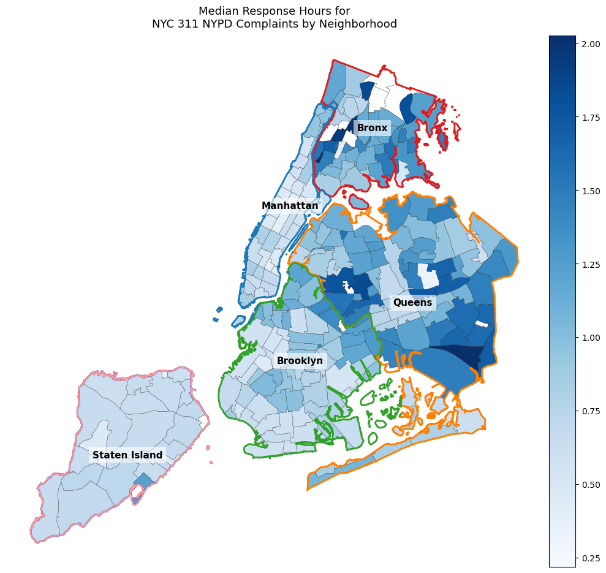
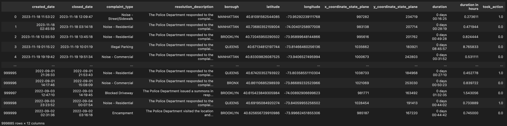
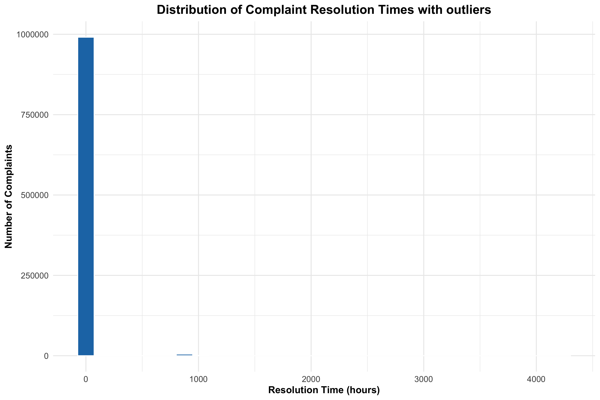
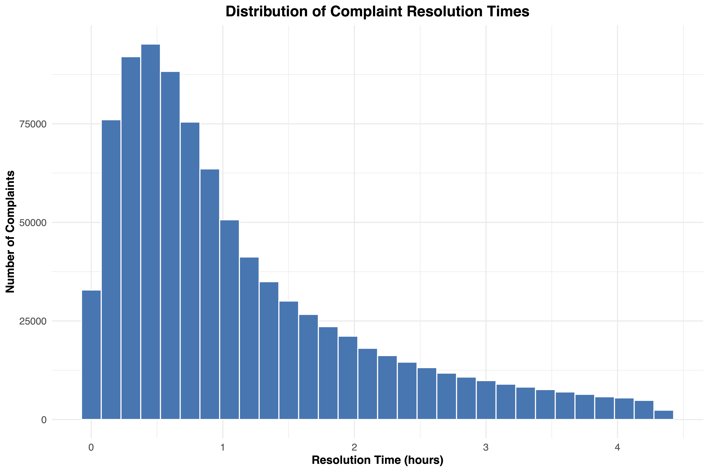
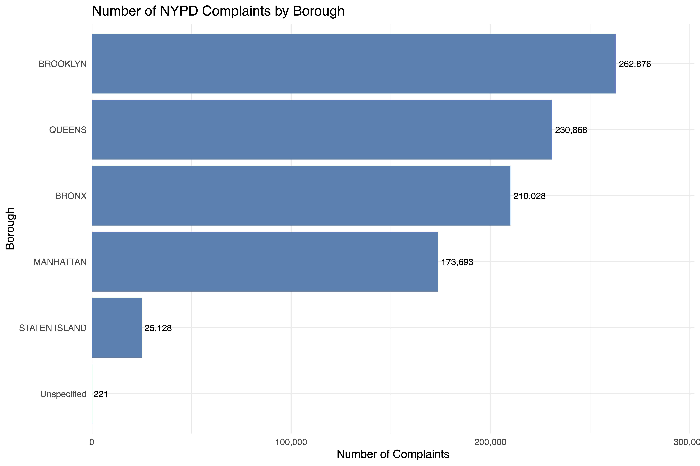
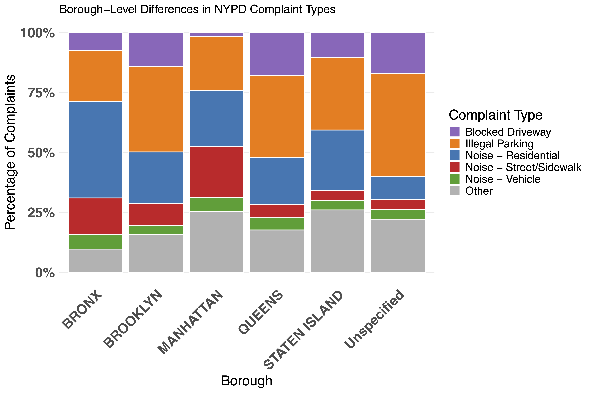
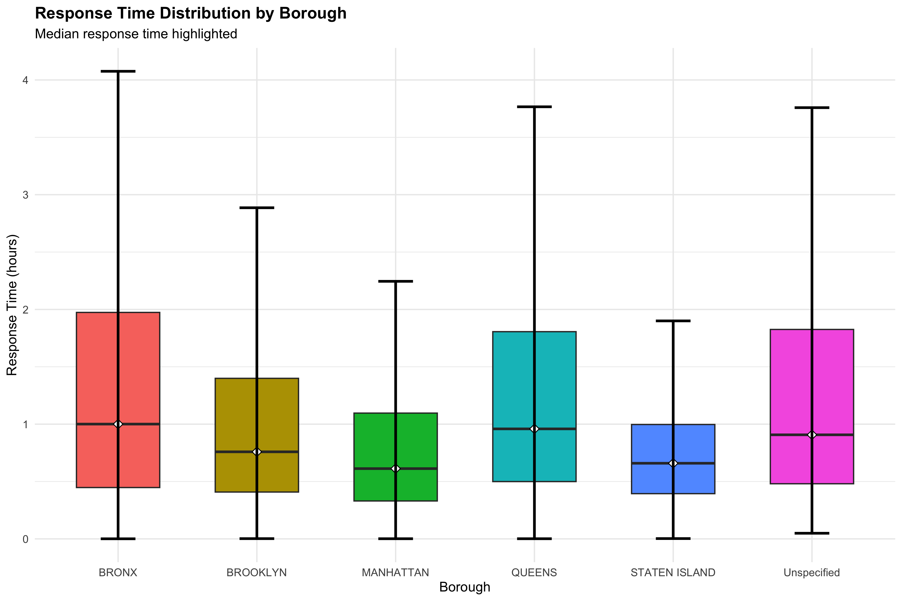
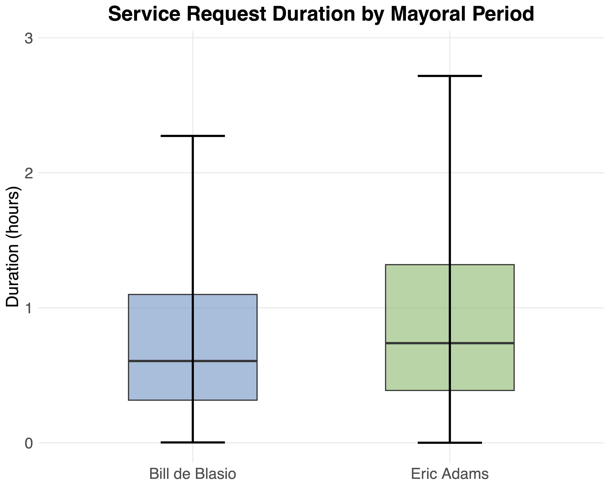

# Analyzing NYC's 311 complaints handled by the NYPD.
Author: Abdelrahman Aggour

## Table of Contents
- [Introduction](#introduction)
- [Context](#context)
- [Data](#data)
- [Statistical Analysis](#statistical-analysis)
- [Questions](#questions)
    - [Are certain complaints more common in some boroughs than others?](#are-certain-complaints-more-common-in-some-boroughs-than-others)
    - [Do Response Times Differ by Borough?](#do-response-times-differ-by-borough)
    - [Does the likelihood of police action differ by borough?](#does-the-likelihood-of-police-action-differ-by-borough)
    - [Do complaints stay open longer under one mayor than the other?](#do-complaints-stay-open-longer-under-one-mayor-than-the-other)
- [Conclusion](#conclusion)
## Introduction
Following recent discourse on equity in public services after New York City’s mayoral election, this study evaluates whether the New York City Police Department (NYPD) resolves service requests uniformly across boroughs.

In this project, I explored and analyzed NYC's 311 complaints handled by the NYPD. Specifically, I attempted to answer the following questions:

* Are certain complaints more common in some boroughs than others?
* Do response times differ by borough?
* Does the likelihood of police action differ by borough?
* Do complaint durations vary by mayoral administration?

## Context

New York City, the largest city in the United States, has a population of approximately 8.48 million residents. It is divided into five administrative regions known as boroughs, each with its own distinct character and demographics. These boroughs are:
| Borough        | Population |
|----------------|------------|
| Brooklyn       | 2,617,631  |
| Queens         | 2,316,841  |
| Manhattan      | 1,660,664  |
| Bronx          | 1,384,724  |
| Staten Island  | 498,212    |

## Data

The data used in this project were obtained from NYC Open Data via two separate API calls, both restricted to 311 service requests handled by the New York City Police Department (NYPD). The first API call retrieved records created between January 1, 2020 and January 1, 2022, corresponding to the final years of Mayor Bill de Blasio’s administration. The second API call retrieved records created between January 1, 2022 and January 1, 2026, corresponding to the Eric Adams administration. While data from both periods were collected to provide context and enable comparison, the majority of the analysis in this project focuses on complaints handled during the Eric Adams administration.

## Statistical Analysis

### Data Distribution
The first thing I looked at was the distribution of the “duration in hours” column. Since the data contained outliers, I removed them using the interquartile range (IQR) method to better visualize the overall distribution.

Since the data contained outliers, I removed them using the interquartile range (IQR) method to better visualize the overall distribution.

As a sanity check, I used the Shapiro–Wilk test to determine whether the data are normally distributed. The resulting p-value was less than 0.05, allowing us to reject the null hypothesis and accept the alternative hypothesis that the data are not normally distributed.

### Number of Complaints by Borough

The Bronx has a high number of complaints relative to its population

### Questions

Given that the data are not normally distributed, I used non-parametric tests to answer the questions.

#### Are certain complaints more common in some boroughs than others?

To examine this relationship, I used a chi-square test of independence. This test helps determine whether the distribution of complaint types varies by borough. The null hypothesis assumes that complaint type and borough are independent, while the alternative hypothesis states that there is an association between complaint type and borough. The resulting p-value was less than 0.05, allowing us to reject the null hypothesis and accept the alternative hypothesis 

We can already see from the bar chart that the types of complaints in Brooklyn differ from those in the Bronx.

#### Do Response Times Differ by Borough?

To examine this relationship, I used a the Kruskal-Wallis test. This test helps determine for comparing distributions across multiple groups. The null hypothesis assumes The distribution of response times is the same across boroughs, while the alternative hypothesis states that at least one borough has a different distribution. The resulting p-value was less than 0.05, allowing us to reject the null hypothesis and accept the alternative hypothesis.

Surprisingly, in the Bronx, the NYPD takes a longer median time to close complaints compared to other boroughs, despite its relatively smaller population, suggesting that complaints there may receive less attention.

#### Does the likelihood of police action differ by borough?

To examine this relationship, I used a chi-square test of independence. This test helps determine whether the distribution of police action varies across boroughs. The null hypothesis assumes that borough and police action are independent, while the alternative hypothesis states that there is an association between borough and police action . The resulting p-value was less than 0.05, allowing us to reject the null hypothesis and accept the alternative hypothesis 

Once again, we see that in the Bronx, the NYPD takes action the least compared to other boroughs.

#### Do complaints stay open longer under one mayor than the other?

To examine this, I used a Mann–Whitney U test. The null hypothesis assumes that there is no difference in complaint durations between the mayors, while the alternative hypothesis states that a difference exists. The resulting p-value was less than 0.05, allowing us to reject the null hypothesis and conclude that complaints do stay open for different lengths of time under the two administrations.

## Conclusion 

Looking at NYC 311 complaints handled by the NYPD, there are clear differences across boroughs and mayors. The Bronx stands out for poor service—complaints there take longer to be resolved and the police take action the least. Complaint types, response times, and whether the police respond all vary across boroughs, and complaints also stay open for different lengths of time under the de Blasio and Adams administrations. Overall, the NYPD doesn’t handle complaints the same way across the city, with the Bronx showing the most concerning gaps in service.

